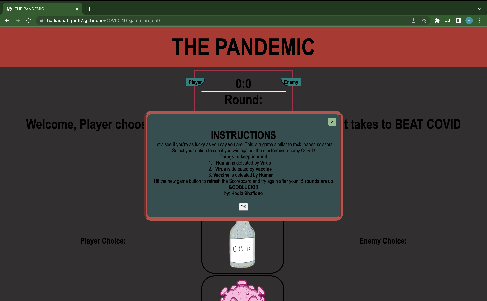
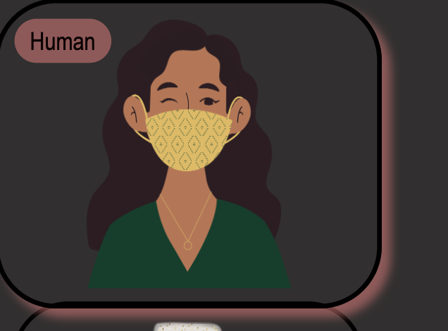
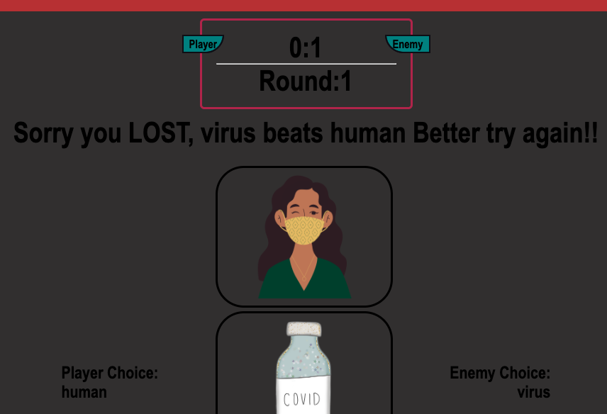
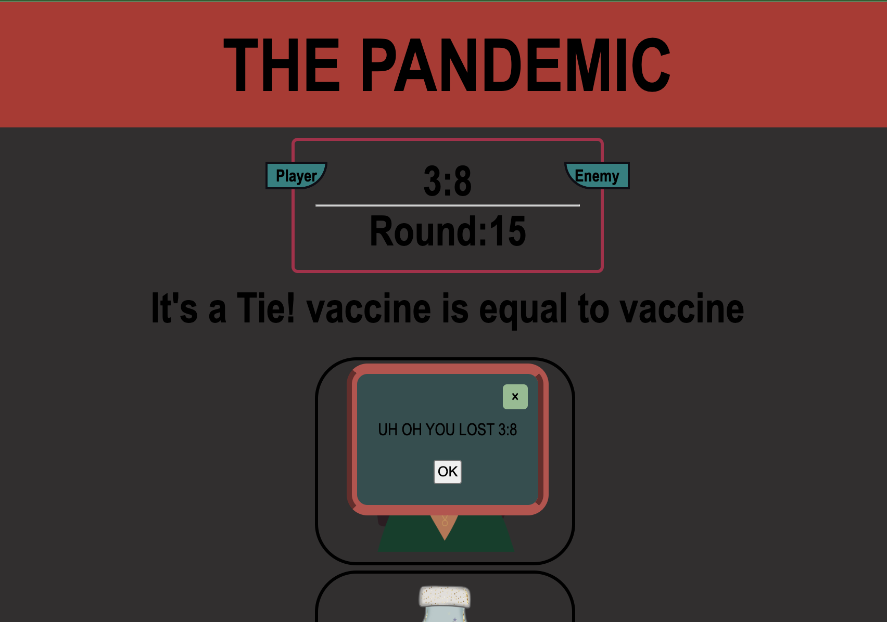
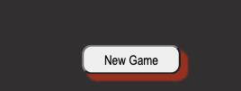

# THE PANDEMIC 
### By: Hadia Shafique
## Motivation

My motivation for this project came from the game of rock, paper, scissors. I wanted to give the world a game that has been around for as long as we can imagine reinvisioned. For the past three years COVID has had such an impact on our daily lives, so I decided to implement a game we all grew up loving into something that are world is still facing today.

 Live link [THE PANDEMIC](https://hadiashafique97.github.io/COVID-19-game-project/)

 ## Access

 You can fork or clone the repo by copy and pasting the following in your terminal 

`git clone https://github.com/hadiashafique97/COVID-19-game-project.git`

Github Link [THE PANDEMIC](https://github.com/hadiashafique97/COVID-19-game-project.git)

### THE GAME/ HOW TO 

The game is once again a spinoff of rock, paper, scissors. The three options in this game that are being used are human, virus, and vaccine. When you load the page after 2 seconds of the page loading a modal pops up that greets the user with the instructions 

The instructions clarify that **Human** is defeated by **Virus**. **Virus** is defeated by **Vaccine**, and **Vaccine** is defeated by **Human**. You can either hit the x or ok to exit out of the instructions. 

The game starts when the user clicks on one of the optionsand selects between human, vaccine and virus. 

Once the user selects its Choice the Enemy at a random makes it's choice. The Player Choice, and Enemy Choice is then also populated on to the left and right of the animations of options. Also Depending on the status the message also changes to match the result of that round and the ScoreBoard and Round update shortly after.

The game goes all the way upto a total of 15 rounds. After the 15 rounds are up the modal will pop up with the correct current Status of Win or lose between the two players. You can then hit x or ok to close the message.

After the 15th round you can then scroll to the bottom of the page and hit the New Game button which will then allow you to reset the scoreboard and start again it will also re prompt the instructions modal.

## Technologies Used
- HTML
- CSS
- JavaScript
- VSCode

## Acknowledgements

I used a lot of resources to help me create my final project. 

- [stack overflow](https://stackoverflow.com/questions/17976883/rock-paper-scissors-in-javascript)

- [youtube](https://youtu.be/qWPtKtYEsN4)